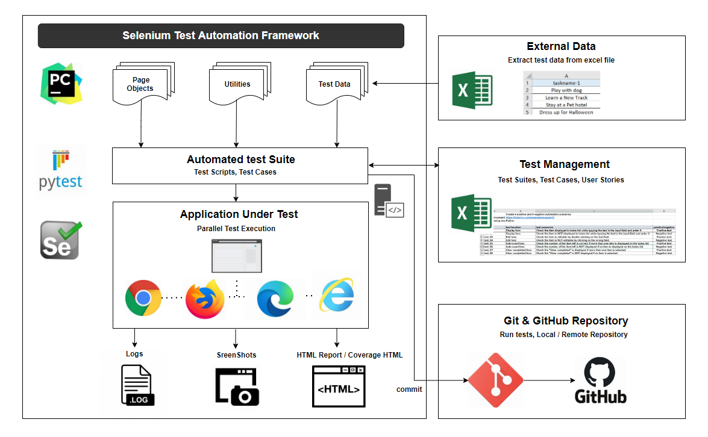

<h1 align="center">ToDosProject</h1>

<h2 align="center">Project Description</h2>

Goal: Create 4 positive and 4 negative automation scenarios with a hybrid test automation framework

Demo site: https://todomvc.com/examples/angular2/ 

Language: In our Selenium Project, I am using Python language.

Testing Framework: PyTest 

Type of Framework: I am using Data-driven Framework by using Page Object Model design pattern

POM: 
As per the Page Object Model, I have maintained a class in the web page with the WebElements of that web page and also contains Page methods which perform operations on those WebElements.

Test Case: 

Test Data:
 All the historical test data will be kept in an excel sheet. By using excel file
, I passed test data and handle data-driven testing by using “ExcelUtils.py” in utilities folder

Test environment : 

<h2 align="center">Test Scenarios</h2>

<h2 align="center">Test HTML Report</h2>

